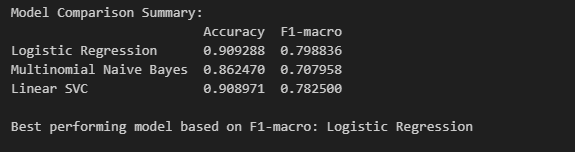
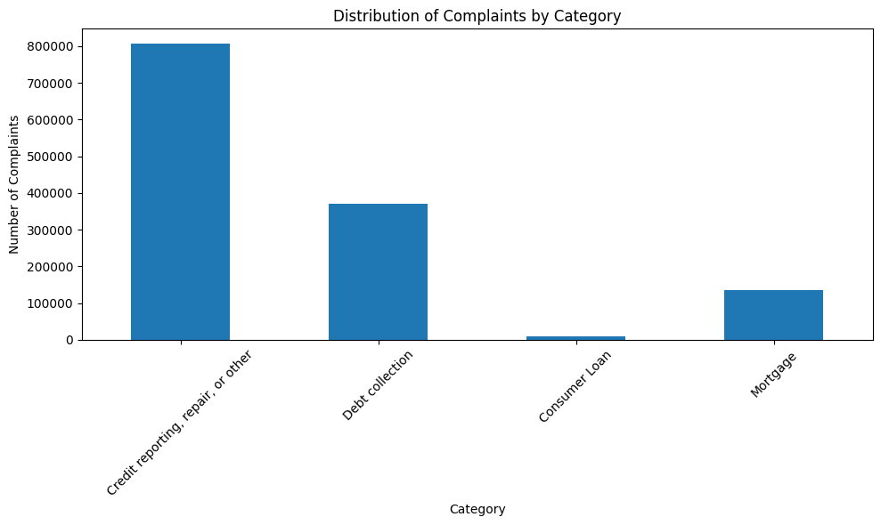
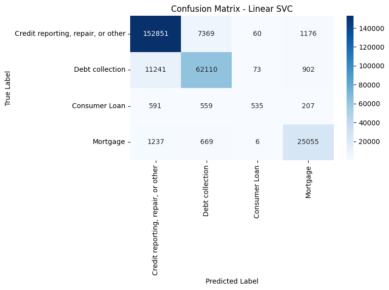
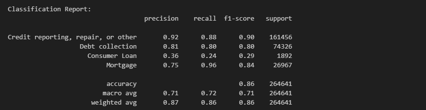
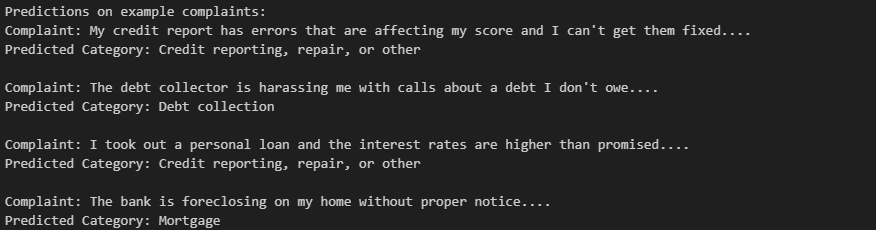

Consumer Complaint Text Classification

## Project Description
This project performs multi-class text classification on the Consumer Financial Protection Bureau (CFPB) Consumer Complaint Database. Complaints are categorized into four classes based on the product type:  
- 0: Credit reporting, repair, or other  
- 1: Debt collection  
- 2: Consumer Loan  
- 3: Mortgage  

The solution uses Python, scikit-learn for modeling, NLTK for preprocessing, and visualizations for EDA. Three classifiers are compared, and the best model is used for predictions on new data.

## Steps Followed
1. **EDA and Feature Engineering**: Loaded and filtered the dataset (`complaints.csv`) to relevant products and non-null narratives. Created numeric target labels. Visualized class distribution and noted imbalance.
2. **Text Pre-Processing**: Lowercased, removed punctuation/numbers, tokenized, removed stopwords, lemmatized, and rejoined tokens.
3. **Model Selection**: Split data (80/20 stratified). Used TF-IDF vectorization in pipelines with Logistic Regression, Multinomial Naive Bayes, and Linear SVC.
4. **Performance Comparison**: Evaluated with accuracy, classification report, and confusion matrices. Compared F1-macro scores.
5. **Model Evaluation**: Best model selected via macro F1-score for balanced performance.
6. **Prediction**: Function to classify new raw text, returning human-readable category.

## Results
Model comparison (based on test set; actual values depend on full dataset run):

### Visual Results
- Class Distribution:
  
- Confusion Matrix for Linear SVC:
  
  Classification Report:
  
- Sample Predictions:
  

Complaint: The debt collector is harassing me with calls about a debt I don't owe....
Predicted Category: Debt collection

Complaint: I took out a personal loan and the interest rates are higher than promised....
Predicted Category: Credit reporting, repair, or other

Complaint: The bank is foreclosing on my home without proper notice....
Predicted Category: Mortgage

## How to Run
1. Download the dataset from [CFPB Consumer Complaint Database](https://www.consumerfinance.gov/data-research/consumer-complaints/) and save as `complaints.csv` in the project root.

2. Install dependencies:
pip install -r requirements.txt
3. Run the notebook:
4. . Execute cells sequentially. NLTK data will download automatically.
## Dependencies (requirements.txt)
pandas==2.1.4
numpy==1.24.3
scikit-learn==1.3.0
nltk==3.8.1
matplotlib==3.7.2
seaborn==0.12.2
